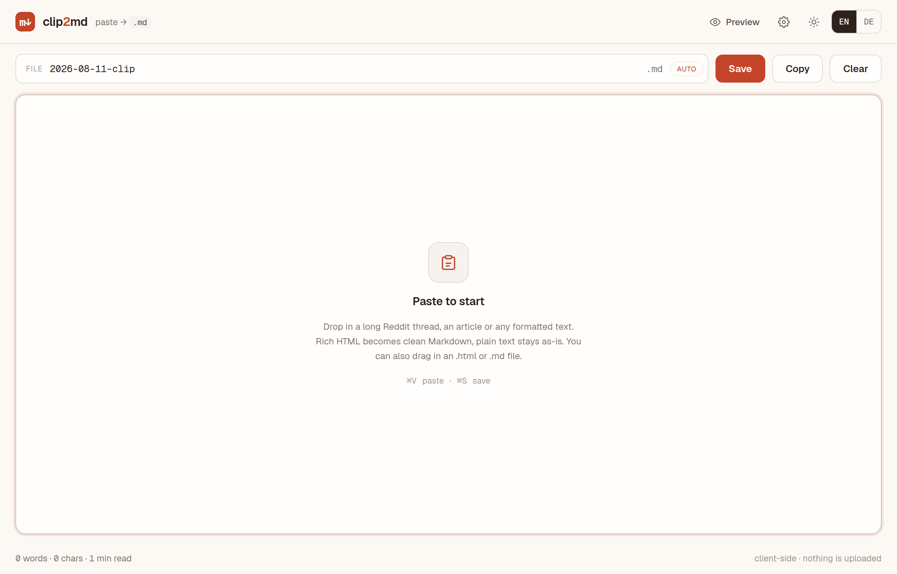
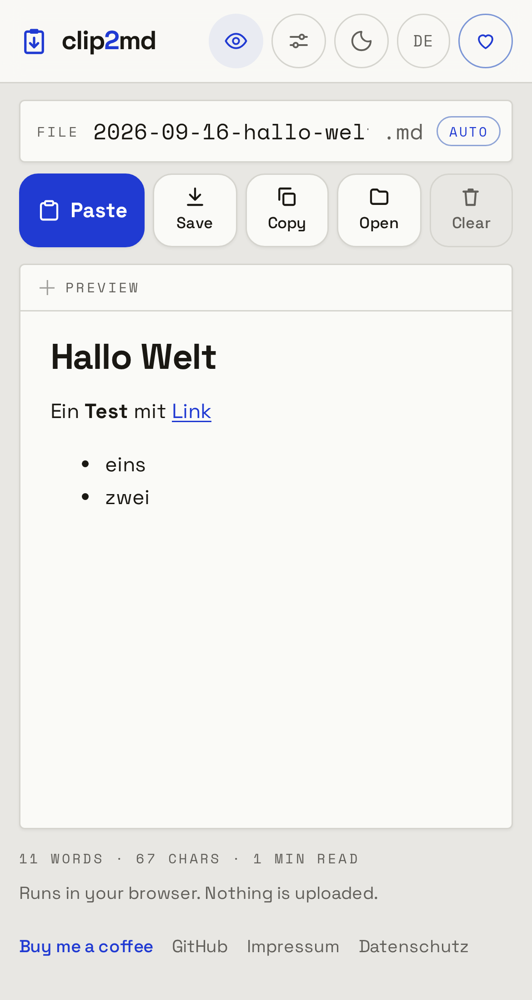

# clip2md — Paste to Markdown

Paste a long Reddit thread, an article, or any formatted web content, and save it as clean
Markdown in one click. Works on desktop and phone. Runs entirely in your browser: nothing is uploaded, no account,
no tracking, works offline.

**Live demo:** https://clip2md.heidrich-digital.de





## Why

Copying from the web and getting usable Markdown is usually two or three tools and a lot of
cleanup. clip2md collapses that into: paste, press save. Rich HTML from the clipboard is
converted to tidy Markdown automatically (via [Turndown](https://github.com/mixmark-io/turndown)
with GitHub-flavored tables, strikethrough and task lists); plain text is kept verbatim. The
filename is proposed for you from the first heading plus the date, so it drops straight into an
Obsidian vault, a wiki, or a repo.

## Features

- **One-click paste.** The *Paste* button reads the clipboard directly (Async Clipboard API) and
  picks the HTML version when there is one. Browsers ask once for permission; `⌘V` always works too.
- **Smart paste.** Formatted HTML (copy from a browser, e.g. Reddit `⌘A` → `⌘C`) is converted to
  clean Markdown. Plain text stays raw. Same `⌘V` for both, no mode switch.
- **Force raw.** `⌘/Ctrl+Shift+V` pastes the next clip as plain text, skipping conversion.
- **Live preview.** Toggle a side-by-side rendered Markdown view (marked + DOMPurify).
- **Auto filename.** Derived from the first heading + date, e.g. `2026-08-11-my-thread.md`.
  Editable — once you type your own, it stops overwriting. Switch to a date+time pattern in settings.
- **YAML front matter.** Optional: prepend `title`, `date`, `source` URL and `tags` for
  knowledge bases like Obsidian.
- **Conversion options.** Links as plain text, strip images, bullet marker (`-` / `*` / `+`),
  heading style (ATX `#` / Setext).
- **Open & drop files.** Pick or drop an `.html`, `.md` or `.txt` file to load or convert it.
- **Mobile-first.** 44 px touch targets, 16 px inputs (no iOS zoom), safe-area aware, settings as a
  bottom sheet; *Save* hands the file to the share sheet (Files, Obsidian, mail) on phones.
- **Bilingual.** English and German, switchable in the header.
- **Light & dark.** Warm paper, one strong blue, clipboard logo; dark mode one click away.
- **Save / copy / clear**, word + character count and reading time.
- **Installable PWA**, fully offline after first load. On Android, clip2md shows up in the
  system share sheet: share a page or selection straight into the editor.

Everything is **client-side**. No servers, no CDNs, no third-party requests — GDPR-friendly by
construction.

## Keyboard shortcuts

| Action | Shortcut |
| --- | --- |
| Save `.md` | `⌘/Ctrl + S` |
| Paste (smart) | `⌘/Ctrl + V` |
| Paste raw | `⌘/Ctrl + Shift + V` |
| Close settings | `Esc` |

## Tech

- Single self-contained `index.html` (inline CSS/JS, OKLCH tokens, Space Grotesk + Space Mono).
- Vendored, no CDN: Turndown + GFM plugin, marked, DOMPurify, fonts — all under `vendor/`.
- Served by `nginx:alpine` (`Dockerfile` + `nginx.conf`) with a service worker for offline use
  (network-first for pages, cache-first for static assets).
- No build step, no backend, no database.

## Run locally

```bash
docker build -t clip2md .
docker run --rm -p 8080:80 clip2md   # http://localhost:8080
```

Or just open `index.html` in a browser (the service worker only registers over http/https).

## Self-host

Any static host works — point it at this repo. The reference deployment uses
[Coolify](https://coolify.io) with a Dockerfile build and a reverse proxy for TLS.

## Update vendored libraries

```bash
npm pack turndown turndown-plugin-gfm marked dompurify @fontsource/space-grotesk @fontsource/space-mono
# turndown/dist/turndown.js                    -> vendor/turndown.js
# turndown-plugin-gfm/dist/turndown-plugin-gfm.js -> vendor/turndown-plugin-gfm.js
# marked/lib/marked.umd.js                     -> vendor/marked.umd.js
# dompurify/dist/purify.min.js                 -> vendor/purify.min.js
# @fontsource/*/files/*-latin-{400,500,700}-normal.woff2 -> vendor/fonts/
```

Bump the `CACHE` constant in `sw.js` whenever an asset changes so clients pick it up.

## License

[MIT](LICENSE). Turndown, marked, DOMPurify, Space Grotesk and Space Mono are under their respective MIT/Apache/OFL licenses.

## Support

clip2md is free. If it saves you time: [buy me a coffee via PayPal](https://www.paypal.com/donate/?business=info%40tillheidrich.de&currency_code=EUR&item_name=clip2md).
